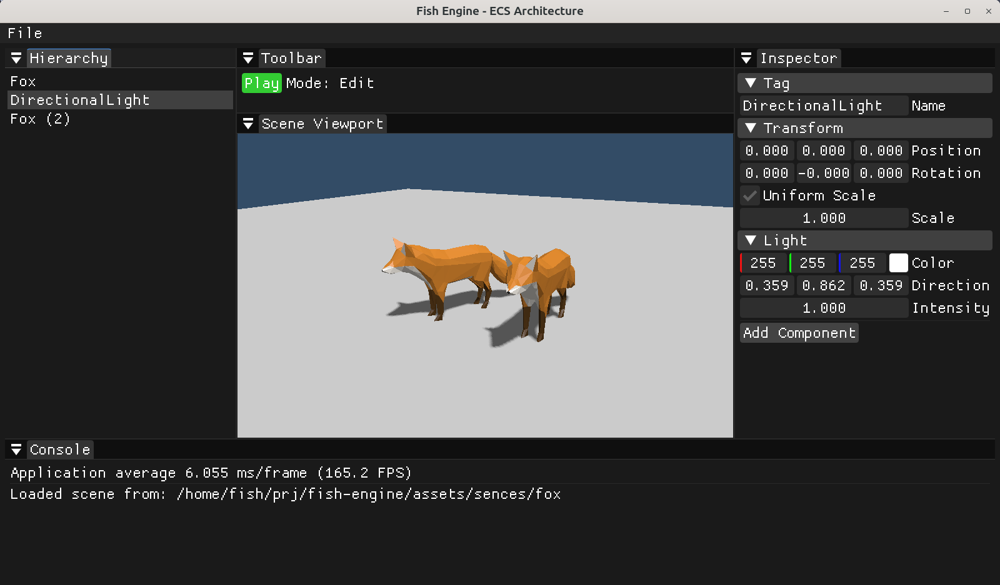

<div align="center">
  <!-- 建议在此处放置一张 800x200 左右的引擎 Logo 图片 -->
  <h1>🐟 Fish Engine</h1>
  <p>一款基于 C++23 和 OpenGL 4.6 的现代、轻量级 3D 图形引擎。</p>

  
  
  
  
  
</div>

<br>



Fish Engine 致力于探索现代图形 API 与实体组件系统（ECS）的结合。项目采用现代 C++ 规范编写，并利用 OpenGL 4.6 的直接状态访问（DSA, Direct State Access）特性，摒弃了传统的全局状态机绑定模式，提供更清晰、高效的渲染管线。

## ✨ 核心特性

### 🏗️ 核心架构
* **现代 C++ 标准**：基于 **C++23** 编写，代码结构严谨、现代化。
* **数据驱动的 ECS 架构**：集成业界领先的 [EnTT](https://github.com/skypjack/entt) 库。
  * **内建组件**：`Transform`, `Mesh`, `Light`, `Tag` 等。
  * **系统**：解耦的 `RenderSystem` 处理渲染逻辑。
* **场景序列化**：支持完整的场景 JSON 格式保存与加载（基于 `nlohmann/json`）。

### 🎨 图形与渲染
* **现代 OpenGL 4.6**：使用 Core Profile 和 DSA 特性。
* **基于物理的阴影 (Shadow Mapping)**：
  * 实现方向光阴影贴图。
  * 采用 **PCF (Percentage-Closer Filtering)** 4x4 采样实现柔和阴影边缘。
  * 动态 Shadow Bias 计算，有效消除“阴影痤疮”（Shadow Acne）。
* **光照模型**：经典的 Blinn-Phong 反射模型，支持多光源。
* **模型与材质**：
  * 借助 `tinygltf` 实现高效的 **glTF** 模型加载。
  * 基础纹理映射支持 (`stb_image`)。
  * 缺失法线模型的自动法线计算生成。

### 🛠️ 编辑器与工具
* **ImGui 可视化面板**：
  * **层级视图**：实时查看和管理场景实体。
  * **属性检查器**：可视化编辑实体的 `Transform`（位置、旋转、等比例缩放控制）及其他组件。
  * **资源管理**：内建模型文件选择对话框。
  * 体验优化：支持实体的自动重命名与输入状态验证。
* **游历摄像机**：内置 FPS 风格的平滑摄像机控制器。

---

## 🚀 快速开始

### 依赖环境
本项目使用 [vcpkg](https://vcpkg.io) 作为包管理器。请确保已安装以下依赖：
* **GLFW3** (窗口与输入)
* **GLAD** (OpenGL 函数指针加载)
* **GLM** (数学库)
* **EnTT** (ECS)
* **nlohmann-json** (序列化)
* *注：`tinygltf` 和 `stb` 已作为源码或库集成。*

### 构建流程

1. **设置环境变量**：配置你的 vcpkg 路径。
   * **Linux / macOS**: `export VCPKG_ROOT=/path/to/vcpkg`
   * **Windows (PowerShell)**: `$env:VCPKG_ROOT="C:\path\to\vcpkg"`

2. **编译项目**：
   你可以使用提供的构建脚本（适用于类 Unix 系统）：
   ```bash
   ./build.sh          # Debug 构建
   ./build.sh -r       # Release 构建
   ./build.sh -c       # 清理并构建
   ./build.sh --run    # 构建并运行
